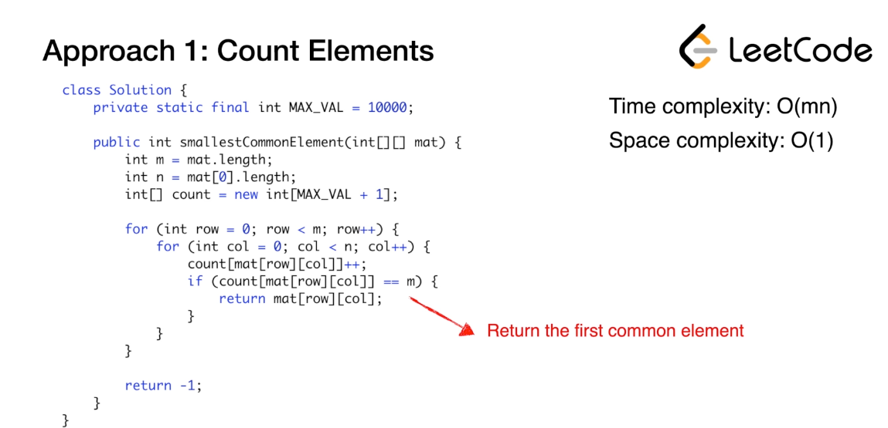
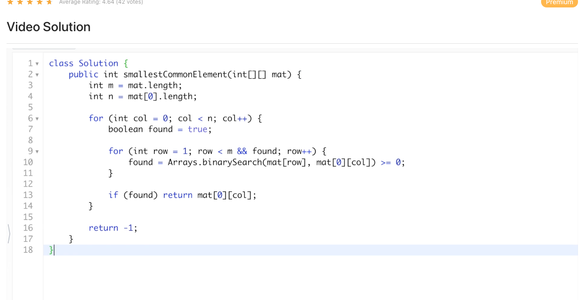

## [1198. Find Smallest Common Element in All Rows](https://leetcode.com/problems/find-smallest-common-element-in-all-rows/)

## [Problem & Example](https://github.com/ssang1105/LeetCode/tree/master/1198-find-smallest-common-element-in-all-rows)

## Questions before reading example

## [나의 풀이](https://github.com/ssang1105/LeetCode/blob/master/1198-find-smallest-common-element-in-all-rows/1198-find-smallest-common-element-in-all-rows.java)
### time complexity : O(m * n)
### space complexity : O(n)
## Count Elements 풀이

### time complexity : O(m * n)
### space complexity : O(1)

## Binary Search 풀이

### time complexity : O(m * n * logn)
### space complexity : O(1)

## Spent time
* 15m

## Review
* hash map 을 사용하여 쉽게 풀었다.
* 같은 아이디어지만, HashMap 안쓰고 Elements 를 count 한 풀이가 더 효율적이고 좋군..
