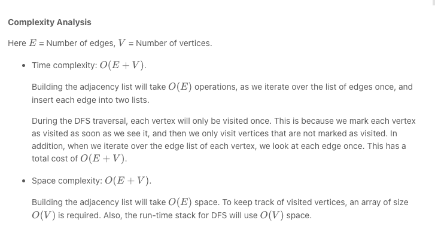

## [323. Number of Connected Components in an Undirected Graph](https://leetcode.com/problems/number-of-connected-components-in-an-undirected-graph/)

## [Problem & Example](https://github.com/ssang1105/LeetCode/tree/master/0323-number-of-connected-components-in-an-undirected-graph)

## Questions before reading example

## [나의 풀이](https://github.com/ssang1105/LeetCode/blob/master/0323-number-of-connected-components-in-an-undirected-graph/0323-number-of-connected-components-in-an-undirected-graph.java)
### time complexity : O(E+V) (E=Number of edges, V=Number of vertices)

### space complexity : O(E+V) (E=Number of edges, V=Number of vertices)
## Spent time
* 30m 이상

## Review
* 어려웠던.. 백트래킹 문제였다.
* Map<Integer,List<Integer> 에 저장하는것까진 잘 도출했지만, 그 이후는 어려웠다.
* 처음에 edgeMap 을 모두 초기화 시키는것도 떠올리지 못해 Solution 을 보았다.
* 한번 더 풀어보면 좋을 문제다.
